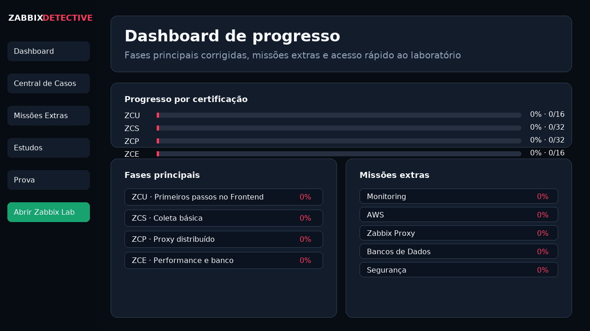
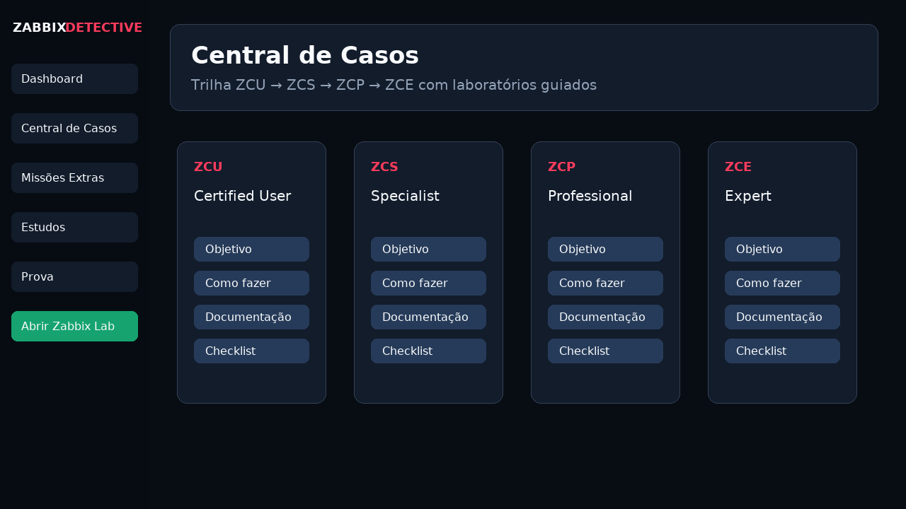
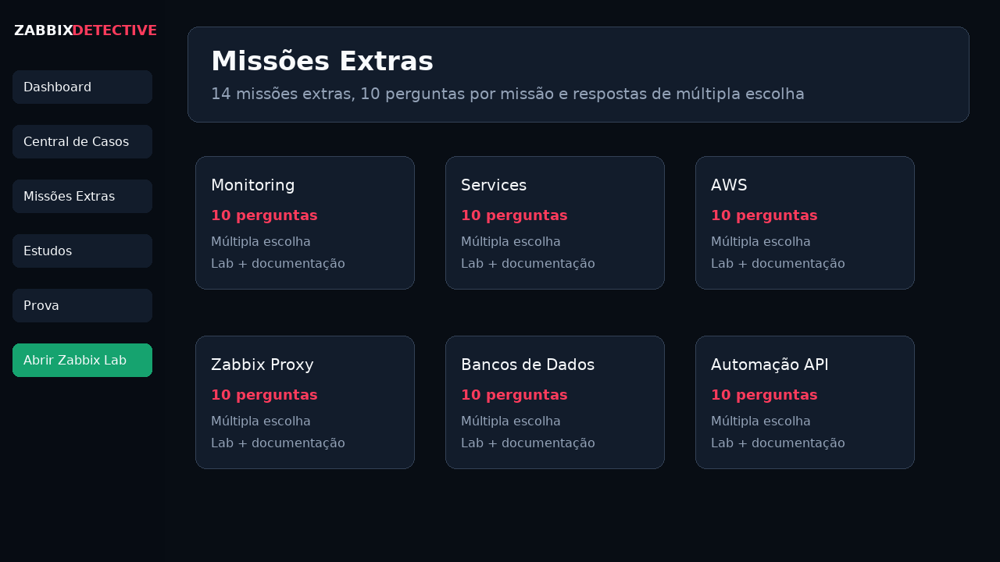
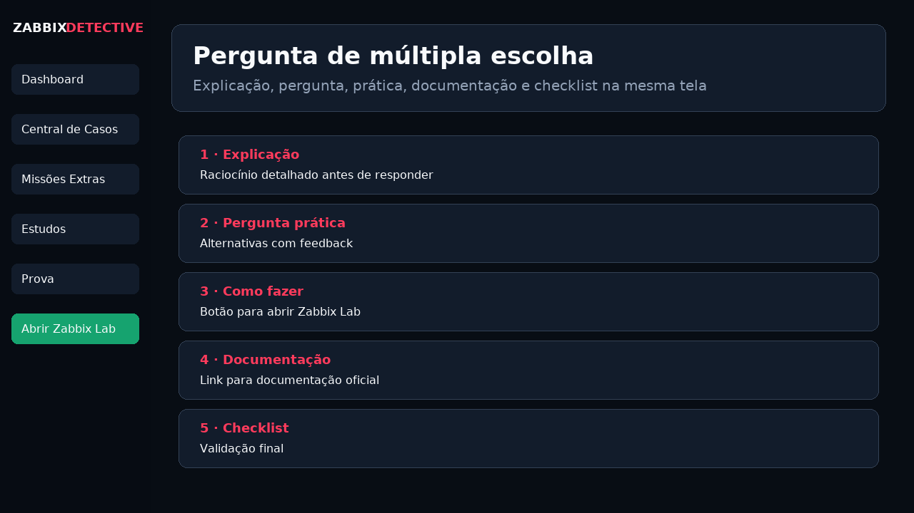
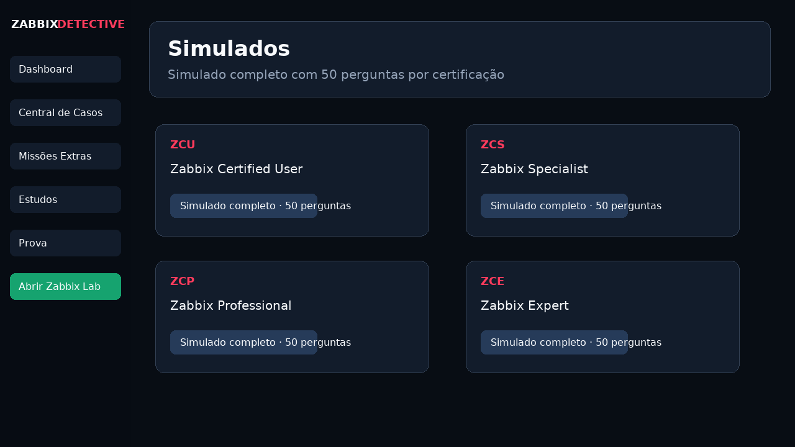

# Zabbix Detective: A Missão

**Zabbix Detective: A Missão** é uma aplicação de treinamento em laboratório para estudar Zabbix de forma prática, progressiva e gamificada.

O projeto foi criado para ajudar no estudo de certificações e operação real de Zabbix, combinando trilhas por certificação, missões extras, simulados, gabaritos, documentação por tema e um laboratório Zabbix executado com Docker.

**Autor:** Leonardo Azevedo

---

## Sumário

- [Visão geral](#visão-geral)
- [Telas do sistema](#telas-do-sistema)
- [Principais recursos](#principais-recursos)
- [Pré-requisitos](#pré-requisitos)
- [Portas utilizadas](#portas-utilizadas)
- [Como executar no Windows](#como-executar-no-windows)
- [Como executar manualmente](#como-executar-manualmente)
- [Acessos padrão](#acessos-padrão)
- [Estrutura do projeto](#estrutura-do-projeto)
- [Fluxo de estudo recomendado](#fluxo-de-estudo-recomendado)
- [Comandos úteis](#comandos-úteis)
- [Como publicar em um novo repositório](#como-publicar-em-um-novo-repositório)
- [Observações importantes](#observações-importantes)

---

## Visão geral

O sistema é composto por duas partes principais:

1. **Aplicação Django**  
   Interface do Zabbix Detective, acessada pelo navegador em `http://localhost:8989`.

2. **Zabbix Lab em Docker**  
   Ambiente de laboratório com Zabbix Server, Zabbix Frontend, PostgreSQL e Zabbix Agent, acessado em `http://localhost:4000`.

A ideia é permitir que o aluno leia uma explicação, responda perguntas, execute validações no laboratório, consulte documentação oficial e acompanhe o próprio progresso.

---

## Telas do sistema

### Dashboard

O dashboard mostra progresso geral, progresso por certificação, fases principais e missões extras.



### Central de Casos

A Central de Casos organiza os laboratórios principais por certificação: ZCU, ZCS, ZCP e ZCE.



### Missões Extras

As Missões Extras trabalham temas específicos, como Monitoring, AWS, Segurança, Banco de Dados e Zabbix Proxy.



### Perguntas de Missões Extras

Cada pergunta de missão extra segue o fluxo: explicação, múltipla escolha, prática, documentação e checklist.



### Simulados

A área de prova possui simulados por certificação, incluindo simulados completos com 50 perguntas.



---

## Principais recursos

### Dashboard corrigido

O dashboard exibe corretamente:

- progresso geral;
- progresso por certificação;
- fases principais;
- missões extras;
- botões rápidos para Central de Casos, Estudos, Prova e Zabbix Lab.

### Central de Casos

A Central de Casos é a trilha principal do projeto. Ela separa os laboratórios por certificação:

- **ZCU** - Zabbix Certified User;
- **ZCS** - Zabbix Certified Specialist;
- **ZCP** - Zabbix Certified Professional;
- **ZCE** - Zabbix Certified Expert.

Cada caso segue o padrão:

1. Explicação;
2. Pergunta prática;
3. Como fazer na prática;
4. Documentação;
5. Checklist.

### Missões Extras

As Missões Extras são treinamentos por tema. Cada missão possui pelo menos 10 perguntas de múltipla escolha.

Missões extras disponíveis:

- Monitoring;
- Services;
- Inventory;
- Reports;
- Data collection;
- Alerts;
- Users;
- Administration;
- Automação API;
- Segurança;
- Ansible;
- AWS;
- Bancos de Dados;
- Zabbix Proxy.

### Zabbix Proxy

A missão extra **Zabbix Proxy** cobre tópicos como:

- proxy ativo;
- proxy passivo;
- last seen;
- hosts atribuídos;
- buffer offline;
- fila do proxy;
- TLS/PSK;
- sincronização de configuração;
- logs do proxy;
- sizing do proxy.

### Simulados

A área de prova conta com simulados por certificação:

- ZCU;
- ZCS;
- ZCP;
- ZCE.

Cada certificação possui:

- simulado rápido;
- simulado completo;
- modo laboratório;
- modo revisão;
- histórico de tentativas.

O **Simulado completo** possui 50 perguntas por certificação.

### Estudos e gabaritos

A área de estudos inclui:

- guias por certificação;
- planos de revisão;
- dicas;
- checklist de preparação;
- links por tema;
- fóruns de estudo;
- explicação de triggers complexas;
- gabaritos da Central de Casos;
- gabaritos das Missões Extras.

---

## Pré-requisitos

### Recomendado para uso completo

- Windows 10 ou Windows 11;
- Docker Desktop instalado e em execução;
- WSL2 habilitado no Windows;
- PowerShell disponível;
- Git instalado, caso o projeto seja clonado de um repositório;
- conexão com a internet na primeira execução para baixar imagens Docker.

### Para execução manual sem os scripts `.bat`

- Python 3.11 ou superior;
- pip;
- Docker e Docker Compose;
- navegador atualizado.

---

## Portas utilizadas

| Serviço | Porta | URL |
|---|---:|---|
| Aplicação Django / Zabbix Detective | 8989 | `http://localhost:8989` |
| Zabbix Frontend Lab | 4000 | `http://localhost:4000` |
| Zabbix Server | 10051 | `localhost:10051` |

Se alguma dessas portas já estiver em uso, pare o processo que está usando a porta ou altere o `docker-compose.yml`.

---

## Como executar no Windows

Na raiz do projeto, execute:

```bat
iniciar.bat
```

O script inicia:

- container Django;
- banco SQLite da aplicação;
- migrations;
- seed das missões;
- seed dos simulados;
- Zabbix Server;
- Zabbix Web;
- PostgreSQL do Zabbix;
- Zabbix Agent.

Depois de iniciar, acesse:

```text
http://localhost:8989
```

Para abrir o laboratório Zabbix:

```text
http://localhost:4000
```

---

## Como executar manualmente

### 1. Criar ambiente virtual

```bash
python -m venv .venv
```

### 2. Ativar ambiente virtual no Windows

```bat
.venv\Scripts\activate
```

### 3. Instalar dependências

```bash
pip install -r requirements.txt
```

### 4. Aplicar migrations

```bash
python manage.py migrate
```

### 5. Popular missões e simulados

```bash
python manage.py seed_game
python manage.py seed_simulados
```

### 6. Iniciar Django

```bash
python manage.py runserver 0.0.0.0:8989
```

### 7. Iniciar Zabbix Lab

```bash
docker compose up -d zabbix-db zabbix-server zabbix-web zabbix-agent
```

---

## Acessos padrão

### Zabbix Detective

```text
URL: http://localhost:8989
```

A aplicação usa um usuário demonstrativo automático para registrar progresso local.

### Zabbix Lab

```text
URL: http://localhost:4000
Usuário: Admin
Senha: zabbix
```

---

## Estrutura do projeto

```text
.
├── docker-compose.yml
├── Dockerfile
├── iniciar.bat
├── iniciar.ps1
├── parar.bat
├── parar.ps1
├── resetar.bat
├── manage.py
├── requirements.txt
├── README.md
├── docs/
│   ├── HOMELAB_DOCKER_ZABBIX.md
│   ├── SIMULADOS_LAB.md
│   └── screenshots/
├── game/
│   ├── models.py
│   ├── views.py
│   ├── urls.py
│   ├── context_processors.py
│   └── management/commands/seed_game.py
├── simulados/
│   ├── models.py
│   ├── views.py
│   ├── urls.py
│   └── management/commands/seed_simulados.py
├── static/
│   └── game/css/style.css
├── templates/
│   ├── base.html
│   ├── game/
│   └── simulados/
└── zabbix_detective/
    ├── settings.py
    ├── urls.py
    ├── wsgi.py
    └── asgi.py
```

---

## Fluxo de estudo recomendado

### 1. Comece pelo Dashboard

Acesse o dashboard para visualizar progresso geral, fases principais e missões extras.

### 2. Use a Central de Casos

Entre em uma certificação e resolva os laboratórios guiados.

### 3. Abra o Zabbix Lab

Use o botão **Abrir Zabbix Lab** para validar a prática no ambiente real.

### 4. Faça Missões Extras

As missões extras reforçam assuntos específicos e usam perguntas de múltipla escolha.

### 5. Revise gabaritos

Use a área de Estudos para consultar gabaritos, documentação e links por tema.

### 6. Faça simulados

Use a área de Prova para fazer simulados rápidos, completos, revisão de erros e modo laboratório.

---

## Comandos úteis

### Iniciar tudo

```bat
iniciar.bat
```

### Parar ambiente

```bat
parar.bat
```

### Resetar laboratório

```bat
resetar.bat
```

### Ver logs Docker

```bash
docker compose logs -f
```

### Recriar banco da aplicação

```bash
python manage.py migrate
python manage.py seed_game
python manage.py seed_simulados
```

### Rodar testes

```bash
python manage.py test
```

---

## Variáveis de ambiente úteis

O projeto possui `.env.example`. As principais variáveis são:

```text
DJANGO_SECRET_KEY
DJANGO_DEBUG
DJANGO_ALLOWED_HOSTS
DJANGO_TIME_ZONE
SQLITE_NAME
ZABBIX_URL
ZABBIX_USER
ZABBIX_PASSWORD
POSTGRES_DB
POSTGRES_USER
POSTGRES_PASSWORD
```

Para uso local, os valores padrões do `docker-compose.yml` já são suficientes.

---

## Observações importantes

- Este projeto é voltado para estudo e laboratório.
- O Zabbix Lab usa credenciais padrão para facilitar o uso local.
- Para produção, altere senhas, secrets, configurações de debug e políticas de acesso.
- O progresso fica salvo localmente no banco da aplicação.
- O reset do ambiente pode apagar dados locais de laboratório.

---

## 📄 Licença

Este projeto pode ser distribuído sob a licença **MIT**.

Sugestão: adicione um arquivo `LICENSE` na raiz do projeto com o texto da licença MIT.

---

## 👨‍💻 Autor

Desenvolvido por **Leonardo Azevedo** como material de apoio para preparação para certificações zabbix em formato interativo.

---

## ⭐ Apoie o projeto

Se este projeto ajudou em estudos, meetups ou treinamentos internos, considere deixar uma estrela no repositório.

```text
⭐ Star no GitHub ajuda outras pessoas a encontrarem o projeto.
```
